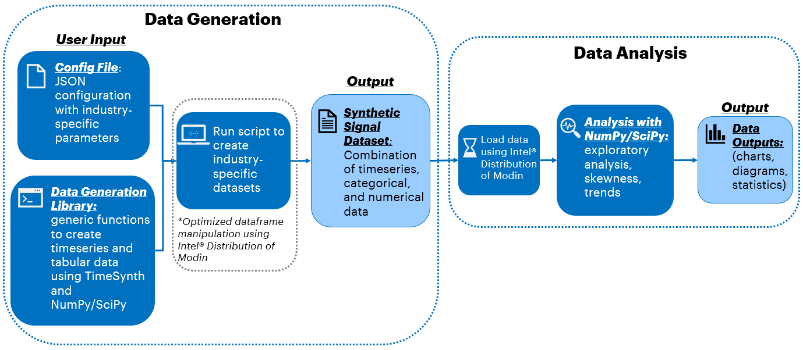

PROJECT NOT UNDER ACTIVE MANAGEMENT

This project will no longer be maintained by Intel.

Intel has ceased development and contributions including, but not limited to, maintenance, bug fixes, new releases, or updates, to this project.  

Intel no longer accepts patches to this project.

If you have an ongoing need to use this project, are interested in independently developing it, or would like to maintain patches for the open source software community, please create your own fork of this project.  

Contact: webadmin@linux.intel.com
# AI Structured Data Generation

## Introduction
Synthetic data in the Artificial Intelligence (AI) field is becoming increasingly popular across different industries. This is because procuring real data for development is not always readily available and having synthetic data opens up a lot more opportunities for AI development. Python*, with its myriad features supporting data and statistical analyses, can also be used for synthetic data generation.

Check out more workflow examples in the [Developer Catalog](https://developer.intel.com/aireferenceimplementations).

## Solution Technical Overview
Synthetic data, a new class of data used for AI development & applications, is increasingly contributing to the global AI training dataset market. The use of synthetic data will increase accessibility and drive innovation toward newer and better AI solutions. Python* offers multiple capabilities for generating and handling synthetic data depending on the use case. For example, time-series data is a subclass of structured data collected across numerous industries. We can use TimeSynth*, an open-source library that provides classes of signals and noise, to mimic real data when leveraging existing Python* libraries including SciPy* and NumPy*.

The purpose of this experiment is to demonstrate how to generate structured synthetic data, with a focus on time-series signal generation using TimeSynth* for the base signal. Furthermore, we can use NumPy* to generate supporting data columns and/or metadata and SciPy* to process any resulting signals, this additional generated data can add more context to specific use cases. In this reference kit, we provide a library of generic functions to build a structured synthetic dataset, including time-series data. The synthetic datasets are built for multiple industry sectors. The dataset and industry sector characteristics are defined using arbitrary parameters in a config file (for example, a distribution from which subscriber count is pulled). These sectors include utilities, healthcare, e-commerce, environmental studies, and finance. As part of this reference kit, we demonstrate dataset creation for e-commerce and utilities sector as well as provide a configuration for building a fully industry-agnostic customized dataset where the user can decide the number of columns, data type for each column as well as the dataset size. 

More information on how the inputs can be configured, which is especially critical for the customized dataset, is presented in the [Appendix](#appendix).

Although they are built using the same libraries, the generated sector datasets will be independent and vastly different from each other due to different base signals and techniques for each sector-specific data. Following the data generation step, which saves the synthetic data as a comma-separated values (CSV) file, we also perform high-level statistical/data analyses on the generated data. Intel® Distribution for Python* and Intel® Distribution of Modin* are used to optimize this pipeline for faster performance.

* ***Intel® Distribution of Modin****

  The [Intel® Distribution of Modin](https://www.intel.com/content/www/us/en/developer/tools/oneapi/distribution-of-modin.html) is a drop-in replacement for Pandas*, enabling data scientists to scale to distributed DataFrame processing without having to change API code. Intel® Distribution of Modin adds optimizations to further accelerate processing on Intel® hardware. Using this library, you can process terabytes of data on a single workstation, scale from a single workstation to the cloud using the same code, and focus more on data analysis and less on learning new APIs. 

  > Please note that some dataset sizes may experience regression when using Intel® Distribution of Modin due to their size and shape. Please refer to the [Intel® Distribution of Modin Getting Started Guide](https://www.intel.com/content/www/us/en/developer/articles/guide/distribution-of-modin-getting-started-guide.html) for more information.


* ***Intel® Distribution for Python****

  The Intel® Distribution for Python* leverages Intel® Performance Libraries to provide accelerated performance for core scientific and machine learning packages. In this reference solution, we are primarily interested in NumPy/SciPy optimizations based on the Intel® oneAPI Math Kernel Library (Intel® oneMKL).

For more details, visit [Intel® Distribution for Python*](https://www.intel.com/content/www/us/en/developer/tools/oneapi/distribution-for-python.html) and [Intel® Distribution of Modin*](https://www.intel.com/content/www/us/en/developer/tools/oneapi/distribution-of-modin.html).

## Solution Technical Details
The data generator includes functions to generate time-series, numeric, and categorical data columns to build out a dataframe. The time-series functions consist of multiple signal types using TimeSynth* that are heavily built on NumPy* and SciPy*, along with context-based functions such as adding noise, seasonality, and anomalies. 

Short description for the datasets that can be generated are included below:

**[No industry] Custom dataset:** industry-agnostic dataset using customization provided in [config file](config/myconfig.json).

**Utilities industry:** electrical transmission signals using periodic functions and add anomalies and Gaussian noise.

**E-commerce:** revenue, sales, and subscriber data using continuously autoregressive signals combined with linear functions for growth. 

More information on other datasets that can be generated can be found in the [Appendix](#appendix).

Each of the datasets have unique additional techniques and metadata that apply to their respective contexts based on the values provided in the configuration file. These generated datasets are saved as CSV files in the `data` directory. The datasets can then be passed through an exploratory analysis pipeline that will output statistics and visuals based on their distribution, skewness, and descriptive values. The numbers are then logged and the visuals are plotted and saved.

Please note, the industry choices were largely arbitrary and are not meant to be exhaustive. Users can update the config file (and the code) to include specific industry-relevant parameters based on their own use case. The levels of flexibility on what can be changed and how are provided in the [Appendix](#appendix).

## Validated Hardware Details

| Recommended Hardware
| ----------------------------
| CPU: Intel® 2nd Gen Xeon® Platinum 8280 CPU @ 2.70GHz or higher
| RAM: 187 GB
| Recommended Free Disk Space: 20 GB or more

Operating System: Ubuntu* 22.04 LTS.

## How it Works
This guide includes details on experiments using this reference kit that were run to highlight the performance benefit of using Intel packages: Intel® Distribution of Modin* and Intel® Distribution for Python* (IDP) which leverages Intel Optimizations for NumPy* and SciPy*.

1. Setting up the environment for Intel® Distribution of Modin* and Intel® Distribution for Python*
2. Proposed reference end-to-end architecture for running benchmarks with Intel® Distribution of Modin* and IDP
3. Executing these reference architecture pipelines (data generation and analysis)

### **Proposed Architecture using Intel® Distribution of Modin***



## Get Started
Start by **defining an environment variable** that will store the workspace path, this can be an existing directory or one to be created in further steps. This ENVVAR will be used for all the commands executed using absolute paths.

[//]: # (capture: baremetal)
```bash
export WORKSPACE=$PWD/ai-structured-data-generation
```

Define `DATA_DIR`, `OUTPUT_DIR` and `CONFIG_DIR`.

[//]: # (capture: baremetal)
```bash
export DATA_DIR=$WORKSPACE/data
export OUTPUT_DIR=$WORKSPACE/output
export CONFIG_DIR=$WORKSPACE/config
```

### Download the Workflow Repository
Create a working directory for the workflow and clone the [Main
Repository](https://github.com/oneapi-src/ai-structured-data-generation) into your working
directory.

[//]: # (capture: baremetal)
```
mkdir -p $WORKSPACE && cd $WORKSPACE
```

```bash
git clone https://github.com/oneapi-src/ai-structured-data-generation.git $WORKSPACE
```
### Set Up Conda
To learn more, please visit [install anaconda on Linux](https://docs.anaconda.com/free/anaconda/install/linux/).

```bash
wget https://repo.anaconda.com/miniconda/Miniconda3-latest-Linux-x86_64.sh
bash Miniconda3-latest-Linux-x86_64.sh
```
### Set Up Environment
Install and set the libmamba solver as default solver. Run the following commands:

```bash
conda install -n base conda-libmamba-solver -y
conda config --set solver libmamba
```

#### **Setting up Intel® Distribution of Modin Environment**
The [$WORKSPACE/env/intel_env.yml](./env/intel_env.yml) file contains all dependencies to create the Intel® Distribution of Modin* environment.

| **Packages required in YAML file**| **Version**
| :---                              | :--
| python                            | 3.10
| intelpython3_core                 | 2024.0.0
| modin-ray                         | 0.24.1
| matplotlib                        | 3.8.2
| tqdm                              | 4.66.1
| pip                               | 23.3.1
| timesynth                         | [e50cdb9](https://github.com/TimeSynth/TimeSynth/commit/e50cdb9015d415adf46a4eae161a087c5c378564)

 Execute next command to create the conda environment.

```
conda env create -f $WORKSPACE/env/intel_env.yml
```

During this setup, `synthetic_data_intel` conda environment will be created with the dependencies listed in the YAML configuration. Use the following command to activate the environment created above:

```shell
conda activate synthetic_data_intel
```

## Supported Runtime Environment
You can execute the references pipelines using the following environments:
* Bare Metal


### Run Using Bare Metal
Follow these instructions to set up and run this workflow on your own development system.

#### Set Up System Software
Our examples use the ``conda`` package and environment on your local computer. If you don't already have ``conda`` installed, go to [Set up conda](#set-up-conda) or see the [Conda* Linux installation instructions](https://docs.conda.io/projects/conda/en/stable/user-guide/install/linux.html).

#### Run Workflow
Once we create and activate the virtual environment(s), we can run the benchmarks for evaluating performance gain for data generation for each experiment.

The generation script `create_dataset.py` generates synthetic data as a combination of time-series, numeric, and categorical values based on the industry parameter that is passed in and the parameters defined in `config/myconfig.json`. All of the data being generated is based on the signals provided by TimeSynth* and basic domain knowledge unless specified in the [Appendix](#appendix). 

> Before running the scripts, please ensure that the appropriate conda environment is activated and TimeSynth* has been installed.

The script to generate the synthetic datasets takes the following arguments:

```shell
usage: create_dataset.py [-l LOGFILE] [-n DATASET_LEN] [-t TIME_DURATION]
    [--industry INDUSTRY] -c CONFIG_FILE -d DATA_DIR

arguments:
  -l, --logfile                   log file to output benchmarking results
  -n, --dataset_len               number of points in dataset
  -t, --time_duration             integer value for length of unit-less time
                                  (used for timesynth)
  --industry,                     provide one of the following industries 
                                  for example dataset: utilities, finance, 
                                  e-commerce, environmental, healthcare, custom
  -c, --config_file               configuration file path
  -d, --data_dir                  directory to save generated data
```

The following sections will provide runtime instructions and expectations per industry option.

##### ***Industry-Agnostic: Customized Structured Dataset***
The provided config file includes a "Custom" section, which can be configured to create a dataset containing any combination of numeric, categorical, and time-series data columns. Default values have been added as an example. More instructions on the config file usage will be provided in the [Appendix](#appendix). With the config file, we provide details such as the number of each column type, number of rows, distributions, signal types and parameters, and other basic but necessary information. Every dataset will have an identifier (ID) column. For the numeric columns, you can provide the distributions and initial values. For the categorical columns, you may provide the possible options and weights for the distribution or choose to generate a unique ID with the given length. For the time-series columns, there are 6 options for the signals based on TimeSynth's signal library: continuously autoregressive signals (CAR), autoregressive signals (AR), nonlinear autoregressive moving average signals (NARMA), sinusoidal signals (SIN), Mackey-Glass signals (MG), and pseudoperiodic signals (PSEUDOPERIODIC). The time-series columns' config includes the signal types and parameters. The config also includes the option of including a target variable column(s) for supervised learning with options for binary or multi-class classification, and numeric regression.

For example, the provided custom config file generates a dataset with 100 rows and consists of 5 numeric columns, 3 categorical columns, 2 time-series columns, and 3 target columns. Typically, there would be only one target column, but there are 3 in the sample config to demonstrate each option. 

To create this custom dataset and log the performance to the `logs` directory, you would run the following commands in the `$WORKSPACE` directory (after creating the appropriate environment outlined above):

***Experiment:***

[//]: # (capture: baremetal)
```shell
python $WORKSPACE/src/create_dataset.py -n 480 -l $OUTPUT_DIR/logs/custom_modin.log \
    --industry "custom" -c $CONFIG_DIR/myconfig.json -d $DATA_DIR
```

This will save a CSV file which reflects the industry and data context along with the size of dataset e.g., `custom_data_480.csv` in the `$DATA_DIR` directory. Please note that this dataset does not have any context or correlation and is for demonstration purposes only.

##### ***Utilities: Electrical Voltage Dataset***
In this dataset, the voltage is modeled as a time-series with each signal containing 1000 (default value) floating point values depicting one cycle of a 50 Hz system power line's voltage. 
Additional metadata columns include the **signal ID** and the dependent variable **target**, which signifies  whether or not the signal has partial discharge (PD). A target value of 0 is negative, which means the signal does not have partial discharge and is functioning normally, whereas a value of 1 means that it is a positive target, so there is partial discharge present and the signal is deemed faulty.

> Note: The context of this dataset is built on the foundation of a Kaggle* competition problem description, but the real data from Kaggle* was not used in generating the synthetic data here. The Kaggle* problem can be found here: https://www.kaggle.com/competitions/vsb-power-line-fault-detection/overview. Furthermore, this synthetic dataset forms the basis for one of our other reference solution kits located here: https://github.com/oneapi-src/powerline-fault-detection

To run this industry's synthetic dataset generation with default values, log the performance to the `$OUTPUT_DIR/logs` directory and save results to `$DATA_DIR`, you would run the following commands in the `$WORKSPACE` directory (after creating the appropriate environment outlined above):

***Experiment:***

[//]: # (capture: baremetal)
```shell
python $WORKSPACE/src/create_dataset.py -n 480 -l $OUTPUT_DIR/logs/utilities_modin.log \
    --industry "utilities" -c $CONFIG_DIR/myconfig.json -d $DATA_DIR
```

This will save `utilities_data_electrical_transmission_lines_{DATASET_LENGTH}.csv` in the `$DATA_DIR` directory. For example, running the experiment(s) with the dataset length parameter set to 480 will save to `utilities_data_electrical_transmission_lines_480.csv` in the `$DATA_DIR` directory.

##### ***E-Commerce: Fashion Sector Dataset***
In this dataset, we look at up to 3 components (specified in the config file) to measure each company's growth: revenue, sales, and subscriber/users. Each of these components have a time-series column with each signal contains 1000 (default value) floating point values tracking the growth dependent on the given sector's financial condition.
Additional metadata columns include the **signal ID** and **store ID**.

The financial condition of the given sector, which is read from the config file, determines the behavior of every signal in the dataset for all of the components.

To run this industry's synthetic dataset generation with default values and log the performance to the `$OUTPUT_DIR/logs` directory, you would run the following commands in the `$WORKSPACE` directory (after creating the appropriate environment outlined above):

***Experiment:***

[//]: # (capture: baremetal)
```shell
python $WORKSPACE/src/create_dataset.py -n 480 -l $OUTPUT_DIR/logs/ecommerce_modin.log \
    --industry "ecommerce" -c $CONFIG_DIR/myconfig.json -d $DATA_DIR
```

This will save `ecomm_data_fashion_{DATASET_LENGTH}.csv` in the `$DATA_DIR` directory. For example, running the experiment(s) with the dataset length parameter set to 480 will save to `ecomm_data_fashion_480.csv` in the `$DATA_DIR` directory.

##### **Data Analysis**
This step of the pipeline runs some basic data analysis on the generated dataset(s). Exploratory statistics regarding distribution, decomposition, and normalization are calculated and logged for each time-series column in the dataset. The means and variances calculated over each time-series signal are then plotted to provide a visual of the distributions. In addition to these analyses for the time-series data, a skewness analysis in conducted on every other numeric, non-time-series column.

The script to run preliminary data analysis on the synthetic dataset(s) takes the following arguments:

```shell
usage: analysis.py [-l LOGFILE] [-d DATA] [-o OUTPUT_DIR]

arguments:
  -l, --logfile         log file to output benchmarking results
  -d, --data            location of the generated data csv file
  -o, --output_dir      location to save plot files
```

For example, to run analysis on the electrical signals dataset with a dataset length of 480 and then log the performance to `$OUTPUT_DIR/logs` directory, we would run the following commands in the `$WORKSPACE` directory (after creating the appropriate environments as above and having the relevant CSV file created and saved in the `$DATA_DIR` directory):

***Experiment:***

[//]: # (capture: baremetal)
```shell
python $WORKSPACE/src/analysis.py -l $OUTPUT_DIR/logs/utilities_modin_analysis.log \
    -d $DATA_DIR/utilities_data_electrical_transmission_lines_480.csv -o $DATA_DIR
```

The log file name can be changed to describe the run.

#### Clean Up Bare Metal
Follow these steps to restore your ``$WORKSPACE`` directory to an initial step. Please note that all downloaded dataset files, conda environment, and logs created by the workflow will be deleted. Before executing next steps back up your important files.

```bash
# activate base environment
conda activate base
# delete conda environment created
conda env remove -n synthetic_data_intel
```

```bash
# delete all synthetic data and plots generated
rm $DATA_DIR/*.csv $DATA_DIR/*.png $DATA_DIR/*.pdf
# delete all logs generated
rm -rf $OUTPUT_DIR
```

### Expected Output
Below are the expected input parameters and output files for synthetic data generation and data analysis:

#### **Synthetic Data Generation**
| **Expected Input**     | **Expected Output**
| :---                   | :--- 
| Config file; optional flags (i.e., logfile, dataset length, time duration, etc.) | CSV file with synthetic data which reflects the industry type, data context and dataset length

|**Example Input**                                 | **Example Output** 
| :---                   | :--- 
| **Runtime flags:** `-n 480 -l $OUTPUT_DIR/logs/log` <br> **Configuration:** `..., "Utilities":{"Distribution": "skewed","Sub-context": "electrical_transmission_lines"}, ...` | **File**: `$DATA_DIR/utilities_data_electrical_transmission_lines_{DATASET_LENGTH}.csv`

#### **Data Analysis**
| **Expected Input**     | **Expected Output**
| :---                   | :--- 
| Location of CSV file with generated structured synthetic data; optional flags (Intel flag and logfile) | Logs and plots summarizing and visualizing the data 

|**Example Input**                                    | **Example Output** 
| :---                   | :--- 
| **Data:** [{signal_id: 0, target: 0, Timeseries_data: [[0, 0.1, 1.2, ...] ... [...]]} ... {...}] <br> **Runtime flags:** `-d $DATA_DIR/utilities_data_electrical_transmission_lines_{DATASET_LENGTH} -l $OUTPUT_DIR/logs/log` | Statistics in log messages, plots of means and variances, plots of trendlines

The `create_dataset.py` script output will show a progress bar for the task. For example, for [Utilities Electrical Voltage Dataset](#utilities-electrical-voltage-dataset) creation, the output will be as follows:

```bash
Data generation can take a while depending on the size expected and level of 
customization. Please wait until the data generation is complete...
adding numeric column
100%|███████████████████████████████████| 480/480 [00:00<00:00, 3805795.69it/s]
adding numeric column - Done

adding categorical column
adding categorical column - Done

adding time-series column
100%|███████████████████████████████████| 480/480 [00:01<00:00, 315.27it/s]
adding time-series column - Done
```

The data analysis output for [Utilities Electrical Voltage Dataset](#utilities-electrical-voltage-dataset) will be as follows:

```
Running Data Analysis for Time-Series Columns
100%|███████████████████████████████████| 480/480 [00:36<00:00, 13.30it/s]
100%|███████████████████████████████████| 1/1 [00:36<00:00, 36.67s/it]
Running Data Analysis for Other Tabular Columns
100%|███████████████████████████████████| 1/1 [00:00<00:00, 857.03it/s]
```

## Summary and Next Steps
Synthetic data offers the flexibility and accessibility to create innovative AI solutions to real problems. As synthetic data becomes a growing focus for AI solutions, it will become increasingly important to optimize the AI pipeline wherever possible. Intel® strives to bring those optimizations in all parts of the data science pipeline, from data generation through model inference. 

Looking at the high-level utility of the different datasets created in this reference kit, with the industry specific ones (utilities, e-commerce, etc.) we took a more targeted approach which also allowed us to demonstrate the functionality of a diverse set of Intel® optimized technologies such as Intel® Distribution of Modin* and Intel® Distribution for Python's optimizations for NumPy* and SciPy*. Having said that, the industry-agnostic dataset is equally and probably more valuable in terms of the actual utility as it allows the user to customize the minutiae of the synthetic data, e.g., defining number of columns needed, data type, distributions, weights, etc. Furthermore, we have also added the capability to generate a basic target value based on regression, binary classification or multi-class classification. One thing that would make the synthetic data even more realistic is (1) adding correlation(s) between features and (2) adding correlation between the response and one or more features. There can be a very high number of possibilities in which these correlations occur in the real world. However, this would have made the scope of this reference kit harder to contain. As a result, this capability is not offered as part of the reference kit. However, we would like to mention it here, since it can easily be added during run-time by drawing from the users' knowledge and subject-matter expertise.

As a reminder, these experiments are provided to highlight the functionality of optimizations seen from Intel® oneAPI technologies in specific business contexts and how they scale. Please bear in mind that the exact gains you see here may or may not match the results of using these technologies in larger-scale real world operations.

## Learn More
For more information about or to read about other relevant workflow examples, see these guides and software resources:

- [Intel® AI Analytics Toolkit (AI Kit)](https://www.intel.com/content/www/us/en/developer/tools/oneapi/ai-analytics-toolkit.html)
- [Intel® Distribution for Python*](https://www.intel.com/content/www/us/en/developer/tools/oneapi/distribution-for-Python*.html)
- [Intel® Distribution of Modin*](https://www.intel.com/content/www/us/en/developer/tools/oneapi/distribution-of-modin.html)
- [Intel® Extension for Scikit-Learn*](https://www.intel.com/content/www/us/en/developer/tools/oneapi/scikit-learn.html)

## **Appendix**

### **How to use the Config File**
The JSON configuration file is provided to allow for repurposing of the `create_dataset.py` Python* script. The following will describe all of the values and options for the config file. The provided config file's values just serve as an example.

Although Custom, Electrical Utilities and Ecommerce data is explored here, the scripts and supporting config are also capable of handling three other use cases i.e., Finance, Healthcare and Environmental. The same procedure needs to be followed to generate data for those industries with the only change being the industry argument being updated for executing the scripts.

***Finance***
| **Value**     | **Options**      | **Comments**
| :---                   | :---                 | :---               
| Economy_health       | "recession", "normal", "boom"    | String value to describe economy, affects the trend of time-series for whole dataset
| Init_values          | [int, int], e.g. [50, 400]       | List of 2 numbers that provides range of starting values for the dataset
| Sectors              | [strings], e.g. [""Energy", "Materials" ...]  | List of strings for the sectors covered in dataset, they provide more context to the data being produced 
| Sub-context          | string, e.g. "stocks"            | Context of data being generated
| Distribution         | "normal", "random"               | This distribution is applied to the starting values using the given range

***Healthcare***
| **Value**     | **Options**      | **Comments**
| :---                   | :---                 | :---               
| Equilibrium_value    | int, e.g. 3                      | List of 2 numbers that provides range of starting values for the dataset
| Sub-context          | string, e.g. "blood_cell_density"  | Context of data being generated. This is a user-defined parameter. Other examples can include "white_blood_cell_count" or "blood_pH" for example. Init values will need to be changed accordingly.
| Distribution         | "normal", "random"               | This distribution is applied to Tau values that determine the stability of the signal

***Utilities***
| **Value**     | **Options**      | **Comments**
| :---                   | :---                 | :---               
| Sub-context          | string, e.g. "electrical_transmission_lines"    | Context of data being generated. This is a user-defined parameter. Other examples can include "transformer_poles" or "transmission_poles" for example.
| Distribution         | "skewed", null               | This determines the distribution of signals with and without partial discharge

***E-commerce***
| **Value**     | **Options**      | **Comments**
| :---                   | :---                 | :---               
| Init_values          | [int, int], e.g. [100, 300]      | List of 2 numbers that provides range of starting values for the dataset
| Financial_condition  | "stable", "crashing", "growing"  | String value to describe business health, affects the trend of time-series for whole dataset
| Categories           | list of 1-3 of predetermined growth metrics, e.g. ["Sales", "Subscribers", "Revenue"] | these are the company's financial data to generate, select any combination of these 3 provided
| Sector               | string, e.g. "fashion"           | Business context of data being generated
| Distribution         | "normal", "random"               | This distribution is applied to the starting values using the given range

***Environmental***
| **Value**     | **Options**      | **Comments**
| :---                   | :---                 | :---               
| Trend                | "positive", "negative"           | Apply linear trend to whole dataset to show change over time
| Init_values          | [int, int], e.g. [200, 600]      | List of 2 numbers that provides range of starting values for the dataset
| Region               | string, e.g. "Indonesia"         | Geographical region being studied, part of context. User can initialize other geo locations
| Sub-context          | string, e.g. "monthly_rainfall"  | Context of data being generated. This is a user-defined parameter. Other examples can include "Temperature_difference" or "AQI" for example. Init values will need to be changed accordingly.
| Distribution         | "normal", "random"               | This distribution is applied to the starting values using the given range

***Custom***
| **Value**     | **Options**      | **Comments**
| :---                   | :---                 | :---               
| Number_of_rows         | int, e.g. 100                    | Number of rows in dataset, same as dataset size
| Numeric_columns        | int, e.g. 5                      | Number of numeric columns
| Numeric_distributions  | {"int": string, ...}, e.g. {"1": "normal", "2": "random", "3": "range", "4": "binomial", "5": "uniform"}   | Dictionary where key is 1-based index and value is one of the following distributions: normal, random, uniform, range, and binomial. Each distribution has respective parameters specified in Numeric_init_vals. Dictionary length must match Numeric_columns value.
| Numeric_init_vals      | {"int": [int, int], ...}, e.g. {"1": [5, 15], "2": [30, 50], "3": [ ], "4": [0, 1, 0.9, 0.1], "5": [0, 10]} | Dictionary where key is 1-based index and value is the range for the distribution. For "normal", "random", and "uniform" distribution, the parameters are a tuple inidicating the range of values in list form, shown in the example. The "range" distribution takes an empty list, for it fills in the range using the dataset size. The "binomial" distribution takes two options and their weights, in the form of [a, b, P(a), P(b)]. Dictionary length must match Numeric_columns value.
| Categorical_columns    | int, e.g. 5                      | Number of categorical columns
| Cat_col_types          | {"int": string, ...}, e.g. {"1": "list", "2": "UID", ...}     | Dictionary where key is 1-based index and value is either "list" indicating the options and weights are provided in the Cat_col_vals, or "UID" which requires a length argument. UID stands for User-ID which is usually a field in most datasets in some form. Dictionary length must match Categorical_columns value.
| Cat_col_vals           | {"int": {"values": [string], "probabilities": [float]}} OR {"int": {"length": int}}, e.g. {"1": {"values": ["red", "orange", "green"], "probabilities": [0.1, 0.23, 0.67]}, "2": {"length": 4}, ...}     | Dictionary where key is 1-based index and value is a dictionary containing the respective parameters for each category column type. For "list" type columns, you must provide the options in values, and their respective weights in "probabilities". The probabilities must add up to 1, or leaving it empty will default to random selection without any weights. Outer dictionary length must match Categorical_columns value.
| Timeseries_columns     | int, e.g. 5                      | Number of time-series columns
| Time_duration          | int, e.g. 1000                   | Length of time, which is the length of each signal
| Time_col_types         | {"int": {string}, ...}, e.g. {"1": "CAR", "2": "NARMA"}   | Dictionary where key is 1-based index and value is TimeSynth signal type from the following options: AR, CAR, NARMA, PSEUDOPERIODIC, SIN, and MG. Dictionary length must match Timeseries_columns value.
| Time_col_params        | {"int": {...}, ...}, e.g. {"1": {"sigma": 15, "starts": [100,200]}, "2": { }, ...}   | Dictionary where key is 1-based index and value is optional time-series parameters specific to each signal, please check [TimeSynth GitHub](https://github.com/TimeSynth/TimeSynth.git) for usage or `add_timeseries_column` function in `src/generator.py`. Outer dictionary length must match Timeseries_columns value, but each column parameters may be left empty as shown in example.
| Target_columns         | int, e.g. 2                      | Number of target columns
| Target_col_types       | {"int": string, ...}, e.g. {"1": "binary", "2": "regression", ...}     | Dictionary where key is 1-based index and value is "binary", "multi-class", or "regression". Each of these types have corresponding parameters provided in the Target_col_classes field. Dictionary length must match Target_columns value.
| Target_col_classes     | {"int": {"values": [string], "weights": [float]}} OR {"int": {"values": [string], "dist": string}}, e.g. {"1": {"values": [0,1], "weights": [0.95, 0.05]}, "2": {"values": [30, 60], "dist": "normal"}, ...}    | Dictionary where key is 1-based index and value is a dictionary containing the respective parameters for each target column type. For "binary" and "multi-class" type columns, you must provide the classes in "values" (only 2 for "binary") and the respective ratio in "weights".  The weights must add up to 1, or leaving it empty will default to random selection without any weights. For "regression" type columns, provide the values and numeric distribution as done for the numeric columns outlined above. Outer dictionary length must match Target_columns value.

### **Acknowledgments**
The following are open-source codebases that helped with the foundation of this experiment:
- https://mmas.github.io/least-squares-fitting-NumPy-SciPy
- https://analyticsindiamag.com/guide-to-timesynth-a-python-library-for-synthetic-time-series-generation/
- https://github.com/TimeSynth/TimeSynth/tree/e50cdb9015d415adf46a4eae161a087c5c378564

### **Notes**

**Please see this data set's applicable license for terms and conditions. Intel® does not own the rights to this data set and does not confer any rights to it.**

### Disclaimers
To the extent that any public or non-Intel datasets or models are referenced by or accessed using tools or code on this site those datasets or models are provided by the third party indicated as the content source. Intel does not create the content and does not warrant its accuracy or quality. By accessing the public content, or using materials trained on or with such content, you agree to the terms associated with that content and that your use complies with the applicable license.

Intel expressly disclaims the accuracy, adequacy, or completeness of any such public content, and is not liable for any errors, omissions, or defects in the content, or for any reliance on the content. Intel is not liable for any liability or damages relating to your use of public content.

